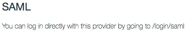
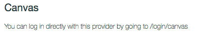
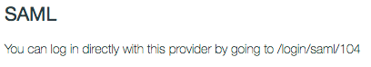

# Discover Page

## Why a Discovery Page, also what is a Discovery Page?

In some cases an instituion using Canvas may have users who authenticate into Canvas using more than one authentication mechanism each using a different page for the collection of authentication credentials.

For example an instution may have a SAML IdP configured for the bulk of their users (ex: students and teachers), but are using Canvas authentication for another type of users (ex: Parents of K-12 students). Another example may be users from different institutions who login to the same Canvas instance, but using two different SAML IdPs. 

When situations like this occur it is nessecary for users to be given a special URL to login to Canvas, so that Canvas can present or redirect the user to the appropriate login page. This can be confusing to users because if they go directly to a Canvas URL and they are not logged in to Canvas then they will be presented with the login page for the first authentication provider in your "[Authentication Settings](https://community.canvaslms.com/docs/DOC-4284)" configuration which may not be the correct login page for that type of user.

The solution to this challenge is to add a "Discovery URL" to your "[Authentication Settings](https://community.canvaslms.com/docs/DOC-4284)" page in Canvas. Once configured, users who are not already logged in to Canvas will be redirected to the URL in the "Discovery URL" field unless the Canvas address they are attempting to visit was a special login URLs. This allows a Canvas admin to provide a location that displays links to the appropriate Canvas login URLs for various types of users.

The links are really the only important compenent of this web page and they must be in a specific format. As such, a best practice is to make the links very promenent on the page.

### Seriously though, what are the URLs?

There are two ways the URLs may need to be formatted. 

**1. If you have only one authentication provider of a specific type then the URL will be in the following format:**

  https://[canvas_URL]/login/[type]
   * [canvas_URL] = Your Canvas address. Example: school.instructure.com
   * [type] = The type of authentication. This information is available within the "[Authentication Settings](https://community.canvaslms.com/docs/DOC-4284)" page after you add the authentication provider in Canvas.
   
Here are some exmples of how this information appears in Canvas:
**Single SAML Configuration in Canvas** (/login/SAML):
    
  
    
**Canvas authenication example in Canvas** (/login/canvas):

  
    
**2. If you have more than one of the same authentication type:**

https://[canvas_URL]/login/[type]/[id]
   * [canvas_URL] = Your Canvas address. Example: school.instructure.com
   * [type] = The type of authentication. This information is available within the "[Authentication Settings](https://community.canvaslms.com/docs/DOC-4284)" page after you add the authentication provider in Canvas.
   * [id] = The ID number for the specific authetnication provider configuration.
   
The URL above would only work for the first authentication of that type in the list (example: multiple SAML IdPs). As a result the "[Authentication Settings](https://community.canvaslms.com/docs/DOC-4284)" page will display a new, more specific, login URL after the second authentication provider of the same type has been added.

**An example when multiple SAML IdP configurations are in Canvas** \(/login/SAML/#):
  
  

## I think I get it, but do you have an example?

Sure thing! Here is an example of a very basic Discovery Page. In this example we are assuming that your Canvas URL is "canvas.instructure.com". So...if you want to use a copy of this page to use for your Discovery Page then you will need to change your URL at a minimum. Oh...I should also mention that the links on the page are unlikly to work, so don't click them. It is just an example.

### [Example Page](example/)
