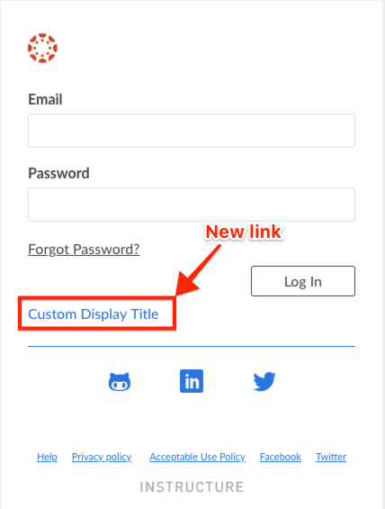

# Add additional link to login page

Follow the steps below in order to add an additional custom link to your Canvas Login page.

- **Download**
  - Download your own copy of the [additional_link_login.js](add_additional_link.js) file.
- **Editing your `additional_link_login.js` file**
  - Replace the `href` value of `#` with the URL you wish to direct users to.
  - Replace the `Change Hover Title` text with the text you wish to display on mouse hover.
  - Replace the `Custom Display Title` text with the text you wish to display in the UI.
  - Save the file.
- **Upload**
  - If a custom JavaScript file ***has been uploaded to your Canvas Theme previously***:
    - Append the text within the [additional_link_login.js](add_additional_link.js) to your existing JavaScript file.
    - Save the file.
    - Upload the edited file to your Canvas Theme Editor, as outlined within this [Canvas Guide](https://community.canvaslms.com/docs/DOC-10862-4214724282).
  - If a custom JavaScript file ***doesn't exist*** in your Canvas Theme Editor yet:
    - Use this [Canvas Guide](https://community.canvaslms.com/docs/DOC-10862-4214724282) as a reference while you upload your edited `additional_link_login.js` file as your new custom JavaScript file.
- **NOTE**
  - As stated in the same Canavs Guide:
  > _*Before adding custom JavaScript and CSS files, you must contact your Customer Success Manager to enable custom branding for your account or sub-account*_

## Support

This is an unsupported, community-created project. Keep that in mind.
Instructure won't be able to help you fix or debug this. That said, the
community will hopefully help support and keep both the script and this
documentation up-to-date.

Good luck!
